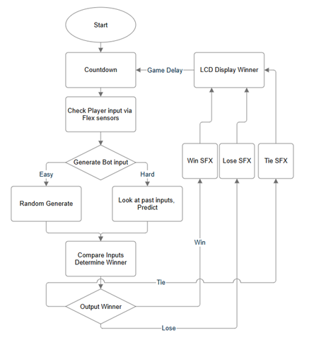
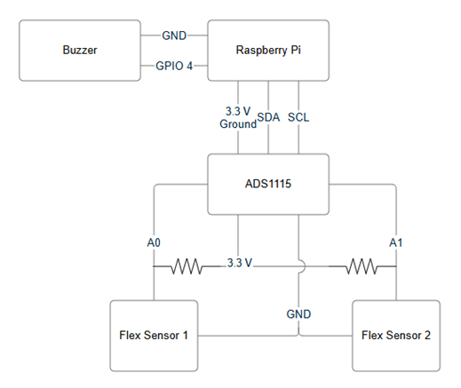
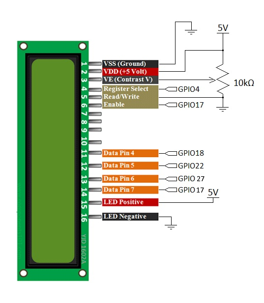
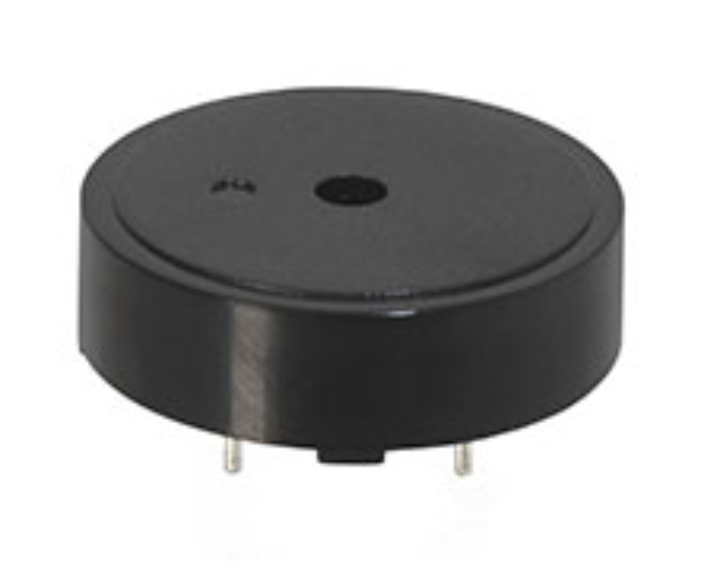
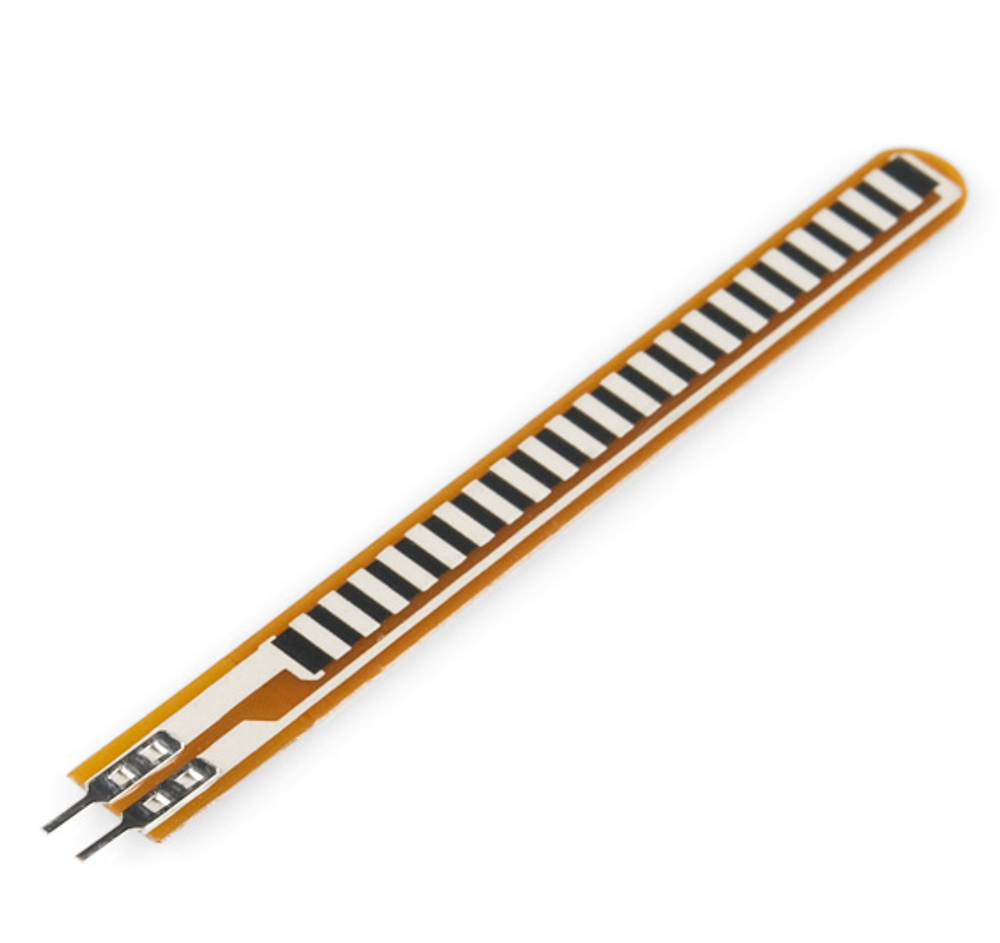

# RPS
Rock Paper Scissors vs Bot
This project uses Raspberry Pi 5, ADS1115, two flex sensors, a 16x2 LCD Display, and a Tonal Buzzer.

The purpose of this project is to be able to play Rock Paper Scissors with a bot, and **actually use your own hand** instead of just typing in your input.

# Software
Below is a flowchart showing the general steps the code goes through as it runs.

The process starts once the rps.py file is run. It displays a short (configurable) countdown on the LCD screen, as well as the code terminal, beeping each second of the countdown. During the last second, it will say "Go!" and beep at a different tone.

The code will read the player's input via the flex sensors, and determine what sign they are making. Then, depending on the difficulty setting, it'll either randomly generate the bot's sign, or it'll look at a list of past inputs, and try and predict. If the list is empty, it'll pick at random.

The two inputs are then compared, and a winner is determined, following Rock Paper Scissors logic. The LCD will also display the inputs, as {player input} vs {bot input}. The LCD will then tell you if you won, lost, or tied with the bot, making a different sound for each outcome. After a short (configurable) countdown, it will start the next round.

# Hardware
Below are a few diagrams showing how each component is connected. 

Make sure all the grounds are shared, and that the LCD is connected to 5V, while everything else is connected to 3.3V.
You can also use a potentiometer on the LCD's pin V0 to control the brightness

# Materials
Below are the components used in the project, along with brief descriptions.

The ADS1115 is used to interpret the analog measurements from the flex sensor and send that data to the Raspberry PI

The buzzer is used as a countdown to signal the player when to show their handsign and plays a noise that notifies if the player wins, loses, or ties.

The flex sensors are the main input, detecting what sign the player throws

The potentiometer is used to adjust the LCD's brightness
